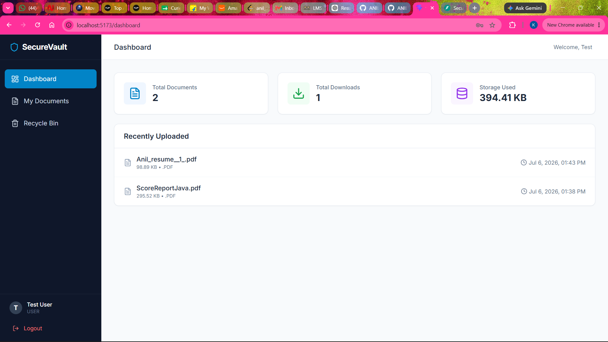

# 🔐 SecureVault

SecureVault is a secure full-stack document management system built using **React**, **FastAPI**, and **SQLite**. It allows users to securely upload, manage, search, preview, and download documents with JWT-based authentication and role-based authorization.

## 🚀 Features

- JWT Authentication
- Role-Based Access Control
- Secure File Upload
- Download & Preview Documents
- Search, Sorting & Pagination
- Soft Delete & Restore
- Dashboard Analytics
- File Validation (.exe, .bat, .ps1 blocked)

## 🛠 Tech Stack

### Frontend
- React
- Vite
- Tailwind CSS
- Axios

### Backend
- FastAPI
- SQLAlchemy
- SQLite
- JWT Authentication
- bcrypt

## 📂 Project Structure

```
SecureVault/
├── backend/
├── frontend/
├── docs/
├── screenshots/
└── README.md
```

## ⚙️ Installation

### Backend

```bash
cd backend
python -m venv venv
venv\Scripts\activate
pip install -r requirements.txt
py -m uvicorn main:app --reload
```

### Frontend

```bash
cd frontend
npm install
npm run dev
```

## 📸 Screenshots



## 📄 License

This project is licensed under the MIT License.